# Backpack Menus
Menu | File |
----- | ---- |
Trade Up | econ/collectioncraftingdialog.res
Stat-Clock | econ/manncotrade_commonstatclock.res
Killstreak Kit | econ/confirmapplystrangifierdialog.res
Killstreak Kit Fabricator | dynamicrecipepanel.res
Giftapult | econ/confirmapplygiftwrapdialog.res
Name Tag & Description Tag | itemrenamedialog.res & itemrenameconfirmationdialog.res & itemrenameinvaliddialog.res
Paint Can | econ/confrimapplypaintcandialog.res

# Matchmaking Menus
Menu | File |
----- | ---- |
 | matchmakingdashboardplaylist.res
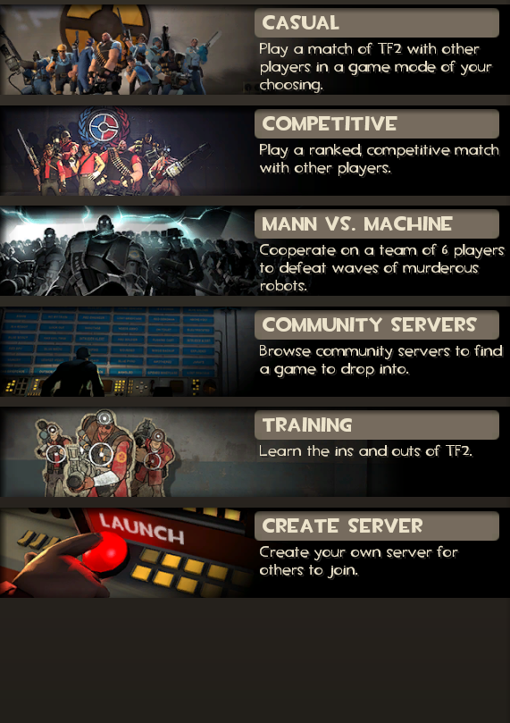 | matchmakingplaylist.res
 | mainmenuplaylistentry.res
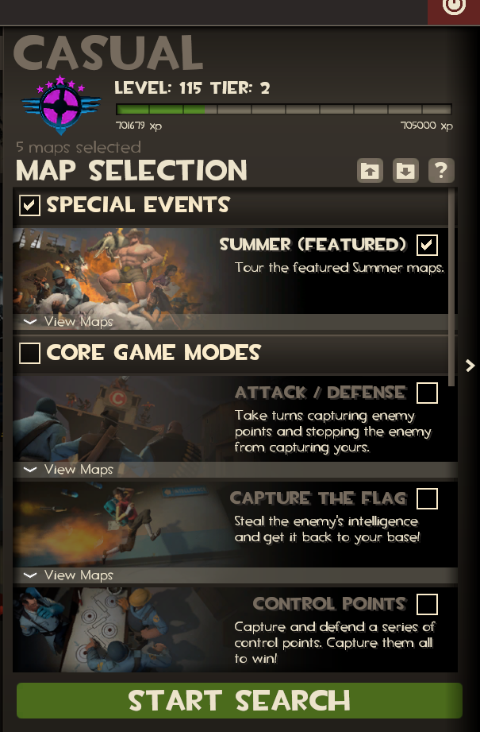 | matchmakingdashboardcasualcriteria.res
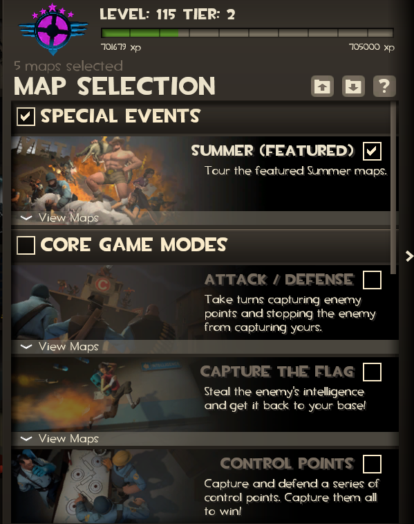 | matchmakingcasualcriteria.res
 | matchmakinggrouppanel.res
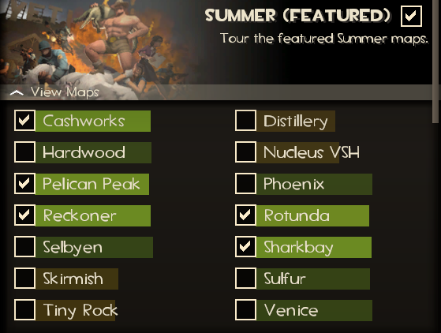 | matchmakingcategorypanel.res
 | matchmakingcategorymappanel.res
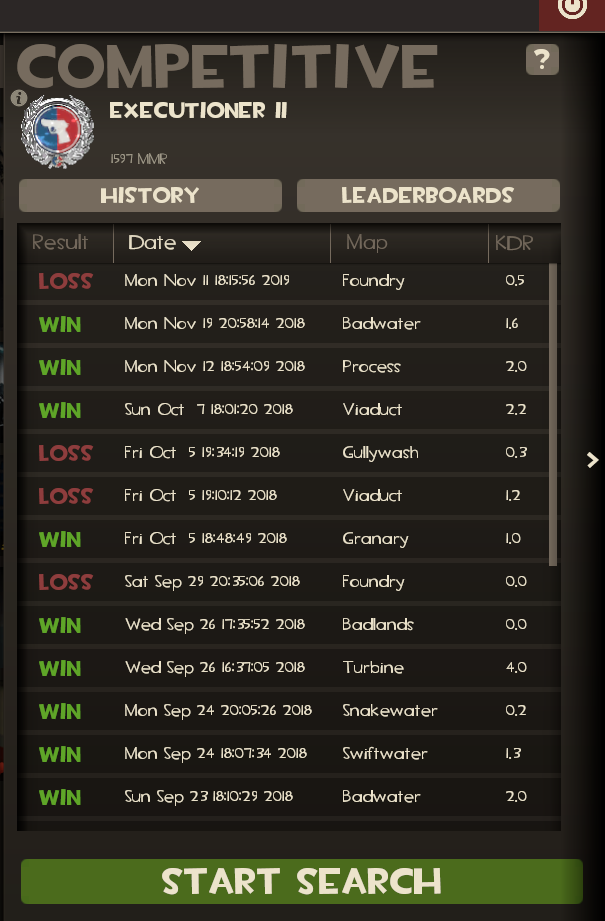 | matchmakingdashboardcomp.res
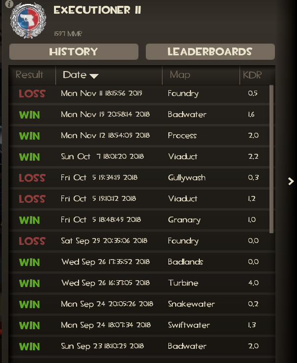 | compstats.res
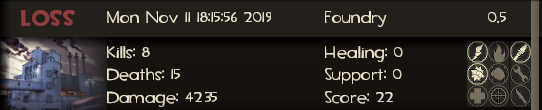 | matchhistoryentrypanel.res
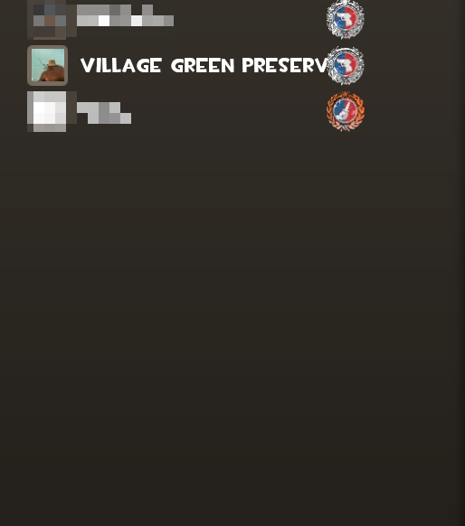 | leaderboardpanel.res
 | leaderboardentryrank.res
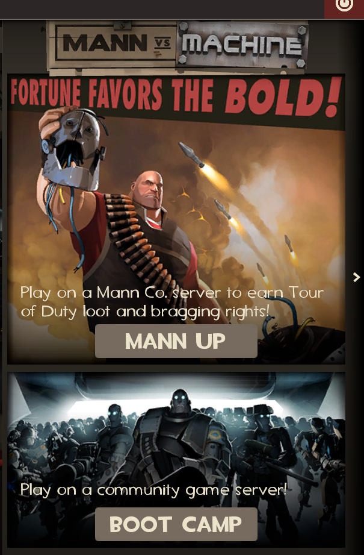 | matchmakingdashboardmvmmodeselect.res
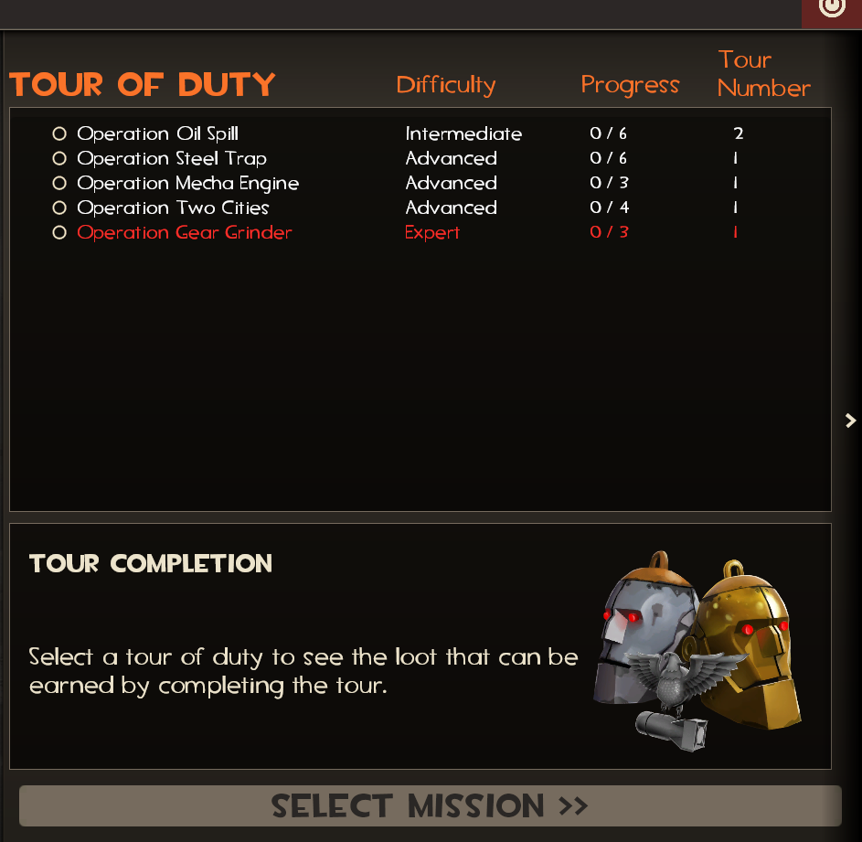 | matchmakingdashboardmvmcriteria.res
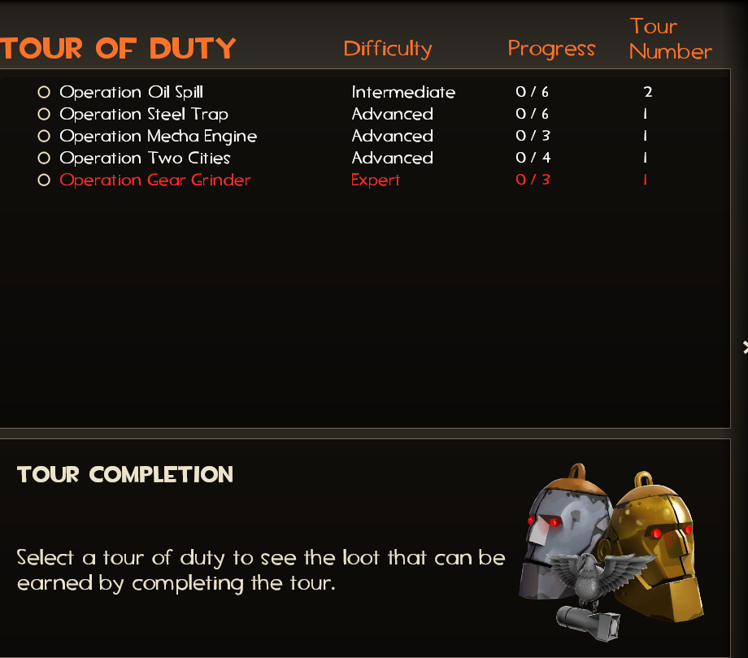 | mvmcriteria.res
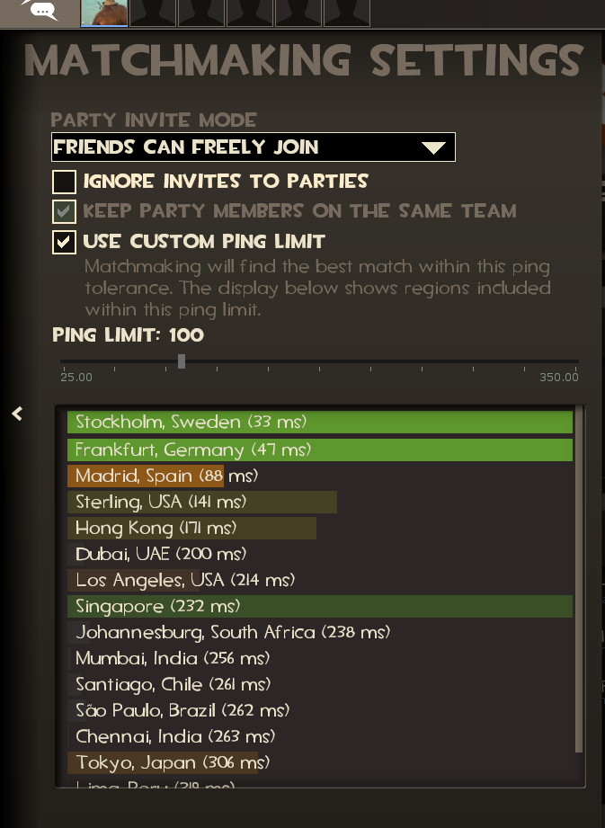 | matchmakingpingpanel.res
 | matchmakingdatacenterpopulationpanel.res
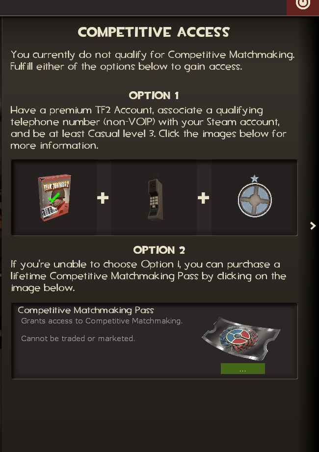 | matchmakingdashboardcompaccess.res
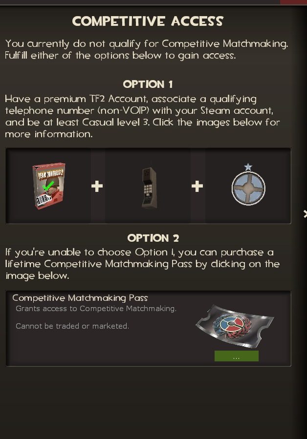 | competitiveaccessinfo.res
